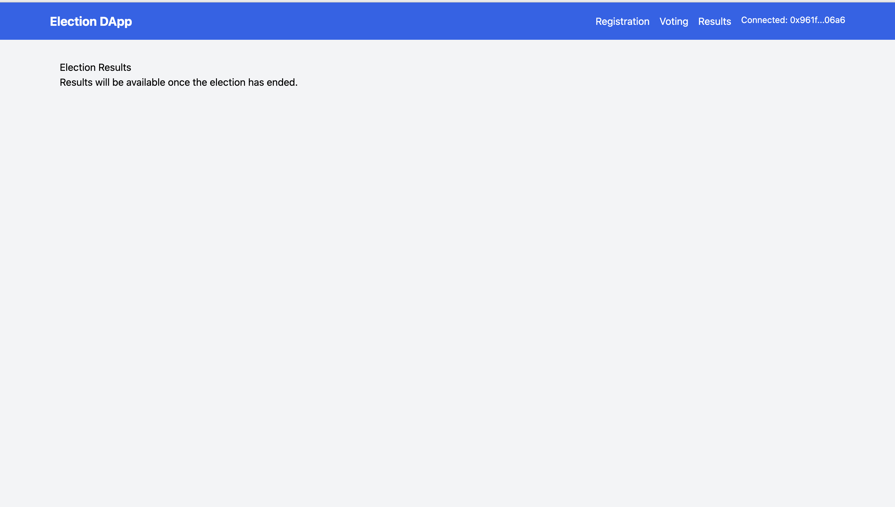

# 🗳️ Decentralized Voting System

A full-stack decentralized voting platform built with Solidity, React.js, Express.js, and Web3.js. This project simulates a real-world election process where users can request voter or contestant access, and vote securely using blockchain technology.



---

## 📁 Project Structure

├── contract
├── backend
├── frontend
├── screenshot.png
└── README.md

---

## ⚙️ Features

### ✅ Smart Contract (Solidity)

- Contestant registration requests and admin approvals
- Voter registration requests and admin approvals
- State-managed voting process: `REGISTRATION → VOTING → ENDED`
- Vote casting with eligibility checks
- Dynamic winner declaration based on vote count

### 💻 Backend (Express.js)

- API endpoints to manage:
  - Voter/contestant data
  - Media uploads (Cloudinary)
  - Additional server-side logic
- Integration with Web3.js for blockchain interaction

### 🌐 Frontend (React.js)

- User-friendly UI to:
  - Request voter or contestant registration
  - Cast a vote once approved
  - Admin panel to approve/reject requests and control election state
  - View live vote counts and results

---

## 🧱 Technologies Used

- **Solidity (0.8.13)** – Smart contract
- **React.js** – Frontend UI
- **Express.js** – Backend API
- **Ethers.js** – Blockchain interaction
- **Truffle** –
- **Cloudinary** – Media upload support
- **Ethereum / Ganache / MetaMask** – Blockchain test environment

---

## 🚀 Getting Started

### Prerequisites

- Node.js
- MetaMask Extension
- Ganache CLI or Hardhat
- Cloudinary account

### Installation

```bash
# Clone the repo
git clone https://github.com/your-username/your-repo-name.git
cd your-repo-name

# Install frontend & backend dependencies
cd frontend && npm install
cd ../backend && npm install
cd ../contract
Smart Contract Deployment (using Hardhat or Truffle)
bash
Copy
Edit
# Example with Hardhat
npx hardhat compile
npx hardhat node  # start local blockchain
npx hardhat run scripts/deploy.js --network localhost
Update contract address in both frontend and backend after deployment.

🛠️ Scripts
Frontend
bash
Copy
Edit
cd frontend
npm start
Backend
bash
Copy
Edit
cd backend
node index.js
🧑‍⚖️ Admin Role
Only the admin (contract deployer) can:

Approve contestant and voter requests

Change election phases (REGISTRATION, VOTING, ENDED)

📸 UI Preview

📝 License
This project is licensed under the MIT License.

🙋‍♂️ Author
Aditya Ghamat
```
